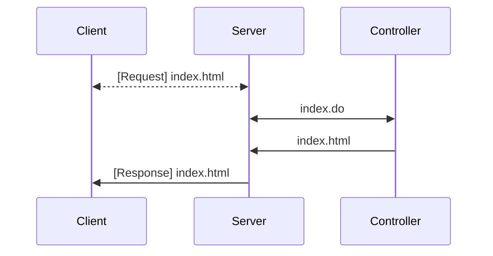

# GitGithub Page
## JavaScript & Java Study!!!

수업시간에 생성한 깃-리토폴로지, 그대로 이어 공부하면 좋겠다~

### 25.02.17
- 이클립스(STS), vsCode로 연결이 되어있다.

---

### 마크다운 문법(mermaid) 
현재 노션에서도 사용가능한 것 같음.

```mermaid
sequenceDiagram
Client <<-->> Server : [Request] index.html
Server <<->> Controller : index.do
Controller ->> Server : index.html
Server ->> Client : [Response] index.html

```
